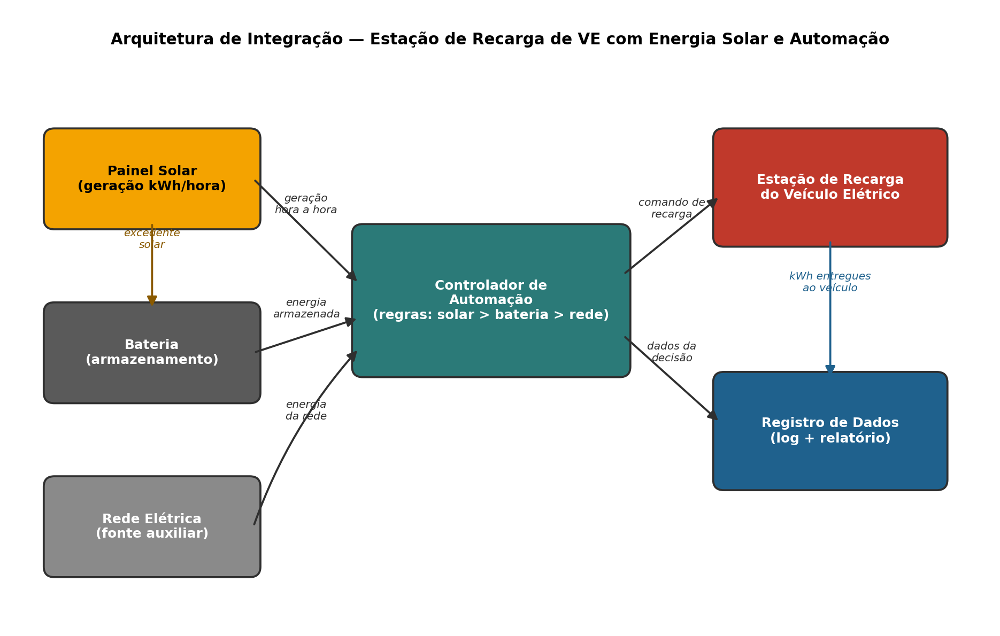

# Sistema de Monitoramento de Consumo Energético e Sustentabilidade

## Sprint 3 – Prototipagem Funcional e Integração

### Integrantes

- André Debiazzi — RM 569062
- Lucas Barros — RM 571528
- Renan Eskildssen — RM 571097
- Kaique da Silva Assis — RM 572718
- Vinicius Cristal de Oliveira — RM 572049

### Vídeo Demonstrativo

Link do vídeo: *(adicionar aqui o link do YouTube não listado)*

---

## 1. Introdução

Na Sprint 2, o projeto entregou um protótipo em Python capaz de calcular o consumo em kWh de equipamentos residenciais e de um veículo elétrico, a partir do tempo de uso informado pelo usuário.

Na Sprint 3, o protótipo evolui de um simples calculador de consumo para um **sistema integrado**, que demonstra na prática como energia renovável, armazenamento e automação trabalham juntos: uma **estação de recarga de veículo elétrico (VE) alimentada por energia solar**, com um controlador de automação que decide, hora a hora, de qual fonte vem a energia usada na recarga.

O objetivo é evidenciar, de forma funcional e simulada, a sinergia entre geração solar, armazenamento em bateria, automação de decisões e coleta de dados — os pilares centrais discutidos na disciplina de Energia e Sustentabilidade.

---

## 2. Esquema de Integração dos Componentes



**Fluxo de funcionamento, hora a hora:**

```
Painel Solar (geração kWh)
        │
        ▼
Controlador de Automação ──► Estação de Recarga do VE
   ▲            ▲                       │
   │            │                       ▼
Bateria      Rede Elétrica       Registro de Dados
(reserva)    (fonte auxiliar)    (log + relatório)
```

O **Controlador de Automação** é o componente central da integração. A cada hora simulada, ele:

1. Verifica quanta energia o **Painel Solar** está gerando naquele momento;
2. Verifica o nível de carga da **Bateria**;
3. Decide automaticamente de onde vem a energia da recarga, aplicando três regras em ordem de prioridade (ver seção 3);
4. Envia o excedente de energia solar não utilizado para a **Bateria**, evitando desperdício;
5. Registra cada decisão e cada leitura no **Registro de Dados**, que gera o relatório final da sessão.

---

## 3. Justificativa Técnica das Escolhas

**Linguagem Python:** mantida da Sprint 2 por ser de fácil leitura, baixo custo de implementação e amplamente usada em automação e análise de dados — o que permitiu focar no raciocínio de integração em vez de detalhes de sintaxe.

**Simulação em vez de hardware físico:** como a geração solar real depende de sensores físicos (irradiância, clima) que a equipe não possui, optou-se por simular a geração hora a hora com valores representativos de um painel de 5 kWp, o que permite demonstrar a lógica de automação de forma controlada e repetível.

**Regra de priorização solar > bateria > rede:** essa ordem reflete a lógica real usada em sistemas de energia renovável — priorizar sempre a fonte mais limpa e já paga (solar), depois a energia armazenada, e só recorrer à rede elétrica quando as outras não são suficientes. Isso maximiza o uso de energia limpa e reduz o custo/impacto ambiental da recarga.

**Bateria como buffer:** sem armazenamento, todo o excedente solar gerado fora do horário de recarga do veículo seria desperdiçado. A bateria permite reaproveitar essa energia mais tarde (por exemplo, no fim da tarde, quando a geração solar cai mas o veículo ainda está conectado).

**Registro de dados simples (listas + relatório):** dispensa banco de dados ou bibliotecas externas, mantendo o protótipo simples de rodar e entender, como pedido para esta etapa, e já demonstra a "coleta e exibição das informações" exigida na Sprint 3.

---

## 4. Resultados e Dados Funcionais

Executando a simulação de um dia (24h), com o veículo conectado das 8h às 18h:

| Indicador | Valor |
|---|---|
| Energia solar gerada no dia | 41,4 kWh |
| Energia total entregue ao veículo | 40,0 kWh |
| Energia vinda do solar | 36,5 kWh |
| Energia vinda da bateria | 3,5 kWh |
| Energia vinda da rede | 0,0 kWh |
| **% da recarga proveniente de energia renovável** | **91,3%** |

O relatório completo, hora a hora — com a geração solar, o percentual da bateria e o comando automático disparado em cada momento — é impresso pelo script `prototipo_sprint3.py` ao final da execução, evidenciando os comandos automatizados exigidos na Sprint 3.

Esses números mostram, na prática, o benefício da automação: em vez de carregar o veículo em qualquer horário usando só a rede elétrica (cenário da Sprint 2, com 100% da energia vinda da rede), o sistema integrado conseguiu suprir mais de 9 em cada 10 kWh da recarga com energia limpa.

---

## 5. Conexão com os Conteúdos da Disciplina

- **Energia renovável:** o painel solar como fonte primária de geração distribuída, tema central da disciplina.
- **Eficiência energética:** a automação evita desperdício de energia solar (armazenando o excedente) e evita sobrecarregar a rede em horário de pico (modo econômico).
- **Armazenamento de energia:** a bateria atua como buffer entre a geração intermitente do sol e a demanda de recarga, tema discutido sobre viabilidade de fontes renováveis.
- **Automação inteligente:** o controlador de automação representa, em escala reduzida, os sistemas de *smart charging* e gestão de demanda usados em estações reais de recarga de VEs.
- **Sustentabilidade:** ao priorizar energia limpa e reduzir a dependência da rede elétrica (muitas vezes gerada por fontes não renováveis), o protótipo demonstra de forma prática o incentivo ao consumo consciente de eletricidade discutido nas Sprints 1 e 2.

---

## 6. Estrutura do Repositório

```
├── prototipo_sprint3.py       # protótipo funcional (Sprint 3)
├── diagrama_arquitetura.png   # diagrama de integração dos componentes
├── Energias_Renováveis_Sprint_2.ipynb   # protótipo original (Sprint 2)
├── README.md                  # este documento
```

## 7. Como Executar

```bash
python3 prototipo_sprint3.py
```

O script solicitará o tempo de uso dos equipamentos domésticos (celular, secador, chuveiro, carro elétrico sem automação) e, em seguida, exibirá automaticamente a simulação integrada de 24h com a recarga do veículo assistida por energia solar.

---

## 8. Conclusão

O protótipo desenvolvido na Sprint 3 evolui a base da Sprint 2 de um simples calculador de consumo para um sistema que demonstra, de forma funcional, a integração entre geração solar, armazenamento em bateria e automação de decisões. Os resultados obtidos (91,3% de energia renovável na recarga simulada) comprovam a viabilidade técnica da proposta e reforçam o potencial da automação inteligente como ferramenta de eficiência energética e sustentabilidade.
